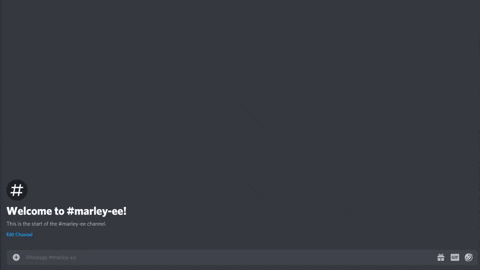

# tournam8

# Short Version

> A discord bot that is equipped with an OCR, custom functions and uses an API to send and retrieve data!

# Long Version

Tournam8 is a [Discord](https://en.wikipedia.org/wiki/Discord_(software)) bot that was built specific for Element, a tournament organization which hosts tournaments for video game called Spellbreak.

During a tournament, players are instructed to take a screenshot of their scores after a game and post them in a Discord channel. Staff members then record all of the player statistics to a spreadsheet. 

To give you more perspective on whats that like. There are about 40 players in a game and there are 6 games played per tournament. That's 240 screenshots per and at an average of 6 characters per screenshots, that is 1440 characters that need to be transferred to an excel sheet.

***Element Logo***

Here is an example of the OCR. The system extracts the data and sends the data to a database through an API.

# Technologies

| Language  | VPS           |   API    | Platform    | OCR     | Imaging     |
|-------------------------------------------|
| Python    | Vultr (Ubuntu)| Flask / SQLAlchmy / Rest JSON API  | Discord | Tesseract OCR / Pytesseract | OpenCV |
