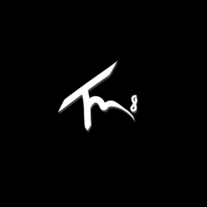
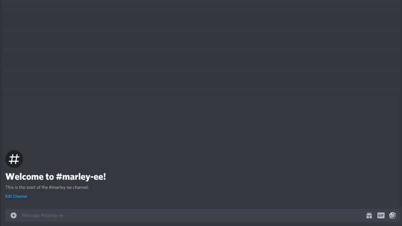

# tournam8

 

## Overview

> Tournam8 is a Discord bot set out to automate an entire tournament process for your favorite video games.

## Motivation

Tournam8's development was motivated after I was exposed to the tournament process of a small community of passionate Spellbreak players struggling to orchestate a complex system over Discord.

During a tournament, players are instructed to take a screen shot of their scores after a game and post them in a Discord text channel where a team of people would work hard to move the data to an excel sheet.

To put that in perspective, there are about 40 players in a game and 6 games per tournament. That's 240 screen shots per tournament, with about 3 tournaments a month, thats 720 screen shots a month, and over 8000 a year.

Among other features, one of the major features of Tournam8 is to completely automate the process of reading data from a screen shot using an OCR.

## API

Tournam8's backend API can be found here. [Here](https://github.com/adavila0703/tournam8-api)

## Tech Stack

* Discord

* FastAPI

* MongoDB

* Discord development API

## Contributions

This project is completely opensource and contribution documentation is currenlty being worked on.

## Warning

Discord.py is the Python library which is used in Tournam8 to communicate to the Discord API. This library is no longer being supported, which means there might either be a change to the projects dependencies or a version of Discord.py will be forked to keep this project up to date with the newest Discord features.
